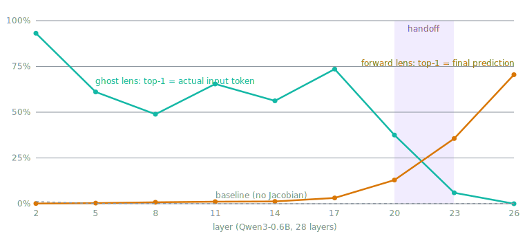

# jlens — Jacobian lens

> **Reference implementation.** Not maintained and not accepting contributions.

> **This fork adds a backward ("ghost-token") lens** — the original lens run in
> reverse, decoding residual states back into *input*-token space. See
> [the ghost-token lens](#this-fork-the-ghost-token-lens) below; upstream
> README follows unchanged after that section.

Companion code for [**Verbalizable Representations Form a Global Workspace in
Language Models**](https://transformer-circuits.pub/2026/workspace/index.html).

The Jacobian lens reads out what an internal activation is disposed to make the
model say. It linearly transports a residual-stream vector at any layer and
position into the final-layer basis, then decodes it with the model's own
unembedding into a ranked list of vocabulary tokens.

The transport is the average input–output Jacobian over a text corpus:

```
lens_l(h) = unembed( J_l @ h ), J_l = E[∂h_final / ∂h_l]
```

The expectation is over prompts, source positions, and all current-and-future
target positions in a generic web-text corpus; the precise estimator
(cotangents summed over target positions, then averaged over source positions)
is documented in the [`jlens.fitting`](jlens/fitting.py) module docstring.

This repo fits the lens on open-weights decoder transformers, applies it, and
renders the interactive layer × position view shown below. Examples use Qwen;
other HuggingFace decoders adapt cleanly.


*The ASCII-face example: selecting the `^` (nose) position shows the lens
reading out "nose" at mid layers, although the word never appears in the
prompt.*

## This fork: the ghost-token lens

The forward lens asks what a residual state is disposed to make the model
**say**. This fork asks the mirror question: **what would the input have had
to be to produce this state?** After self-attention mixes tokens together,
what is each residual position still holding — and does the model ever
*rearrange* its context in place, or only dissolve it?

Fit the mirror-image Jacobian, rooted at the embedding output (position-free
under RoPE):

```
K_l = E[∂h_l / ∂emb]
```

Then decode a residual vector `h` without ever inverting `K_l`: enumerate the
vocabulary and score each token `v` by `⟨h, K_l e_v⟩ − ½‖K_l e_v‖²` — i.e.
find the input embedding whose forward image under the average linearized
dynamics lands nearest to `h`. The result is a **ghost input**: an "as-if
context", not a causal reconstruction.



Findings on Qwen3-0.6B (24 WikiText fit prompts, 8 held-out eval prompts,
layers {2, 5, …, 26}; full numbers in [`out/ghost_results.json`](out/ghost_results.json)):

- **Input identity survives to layer 20, then hands off.** Ghost top-1
  recovers the actual input token 93% at layer 2 and 49–74% through layer 20,
  then collapses (6% at L23, 0% at L26) exactly as the forward lens's match
  with the model's final prediction rises (13% → 36% → 70%). The crossover
  sits at ~75–80% of depth. A no-Jacobian baseline is ~0% everywhere.
- **Nothing moves — it dissolves in place.** Ghost top-1 is a token from
  *elsewhere in the prompt* at most 4% of positions at any layer: when a
  position stops holding its own token it drifts to tokens outside the prompt
  entirely, never to a neighbour's. Dissolution, not permutation.
- **Meaning outlives language.** On a French prompt the ghost input drifts
  cross-lingually (`avec → WITH`, `marchands → merchants`); by layer 23 seven
  scattered positions read `mercado` — the state remembers it's about a
  market, not which words said so. The upstream ASCII face reconstructs
  verbatim through layer 20 (the `^` stays a `^`).
- **The handoff is a global phase transition, not a per-token trigger.**
  Per-position hold duration does not predict per-position convergence timing
  (partial corr ≈ +0.06 after controls, [`out/pivot_analysis.py`](out/pivot_analysis.py));
  every position sheds input identity in the same L20–23 band.
- **Deep-layer ghost "junk" is output-flavored — causally.** Replacing a
  position's real input token with its L23 ghost token (and rerunning the
  model on the edited prompt) preserves the model's
  prediction 15% vs 9% (vocabulary-matched control) vs 7% (random); mildly
  dissolved ghosts are functional synonyms (33%, median rank 4), fully
  dissolved junk is a lossy shadow ([`out/ghost_patch.py`](out/ghost_patch.py)).
- **The mean transport has no "from where."** An offset-resolved family
  `K_Δ = E[∂h_l[p+Δ]/∂emb[p]]` (one matrix per lookback distance) is not
  distance-selective: every band's readout leaks the *self* token, the only
  above-chance cross-position signal is adjacent tokens at L20 (2.9×, gone
  by L23), and explaining away the self component unmasks nothing. Averaged
  over a corpus, attention transport carries no distance-indexed copy
  structure — source attribution needs per-prompt Jacobians
  ([`jlens/offset.py`](jlens/offset.py), [`out/eval_offset.py`](out/eval_offset.py)).

Code: [`jlens/backward.py`](jlens/backward.py) (estimator + `BackwardLens`,
mirroring `fit()`/`JacobianLens`), [`jlens/offset.py`](jlens/offset.py) (the
offset-resolved `K_Δ` variant: "what, and from where"), fit/eval scripts and
experiment notes in [`out/`](out/) ([`out/README-ghost.md`](out/README-ghost.md)).
The full interactive results page — charts, ghost grids, follow-up
experiments — is self-contained at
[`out/ghost-lens-results.html`](out/ghost-lens-results.html) (open locally in
a browser).

```python
from jlens.backward import BackwardLens, fit_backward

lens = fit_backward(model, prompts, target_layers=[2, 5, 8], checkpoint_path="out/b_ckpt.pt")
ghost_logits, input_ids = lens.apply(model, "some prompt")  # {layer: [pos, vocab]}
```

---

## Install

```bash
pip install -e .
```

## Usage

### Apply

To apply a pre-fitted lens:

```python
import transformers, jlens

hf = transformers.AutoModelForCausalLM.from_pretrained("org/model").cuda()
tok = transformers.AutoTokenizer.from_pretrained("org/model")
model = jlens.from_hf(hf, tok)

lens = jlens.JacobianLens.from_pretrained("org/lens-repo", filename="model/lens.pt")
lens_logits, model_logits, _ = lens.apply(
    model, "Fact: The currency used in the country shaped like a boot is",
    positions=[-2])
for layer, logits in sorted(lens_logits.items()):
    print(layer, [tok.decode([t]) for t in logits[0].topk(5).indices])
```

### Fit

To fit a lens on your own model:

```python
lens = jlens.fit(model, prompts=my_prompts, checkpoint_path="out/ckpt.pt")
lens.save("out/jacobian_lens.pt")
```

The paper's lenses use 1000 sequences of 128 tokens from a pretraining-like
corpus. Quality saturates quickly (§9.3); ~100 prompts is usable. This is a
reference implementation and is not optimized; fitting time is dominated by
the model's own backward pass. Parallelize by running `fit()` on disjoint
slices and combining with `JacobianLens.merge()`.

## Walkthrough

[`walkthrough.ipynb`](walkthrough.ipynb) is the end-to-end notebook: load a
model, load (or fit) a lens, apply it at a few layers, and render a slice page
like the one above.

Reading a slice page:

- Each cell shows the lens top-1 word at that (position, layer); the
  superscript is its rank over the full vocabulary.
- Click a cell to select a (position, layer) and pin its top-1 token; pinned
  tokens get rank-tracking charts and a rank heatmap.
- The bottom row (`L = n_layers − 1`) is the model's actual output.

## License and data

Code is released under the Apache License 2.0 — see [LICENSE](LICENSE).

The replication and lens-eval prompt sets in [`data/`](data/) are synthetic,
authored by Anthropic, and released under the same Apache License 2.0 as the
code. See the READMEs in [`data/experiments/`](data/experiments/) and
[`data/evaluations/`](data/evaluations/) for what each set contains.

The slice-vis pages use [d3](https://github.com/d3/d3) (ISC license), loaded
from the jsDelivr CDN with subresource integrity or inlined into
self-contained pages.

No model weights or text corpora are bundled; models and datasets downloaded
at run time are subject to their own licenses.
